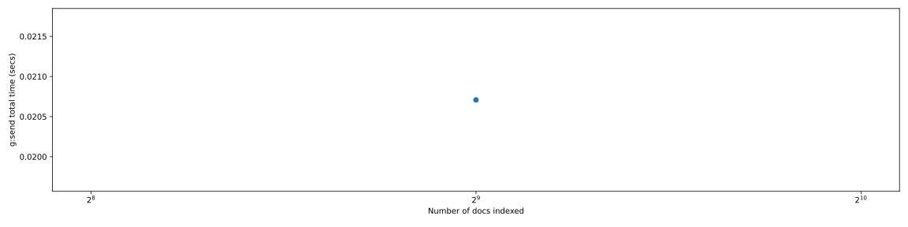

<h3>Results</h3><table border="1" class="dataframe">
  <thead>
    <tr style="text-align: right;">
      <th></th>
      <th>g-&gt;p0:send</th>
      <th>g:send</th>
      <th>p0-&gt;p1:send</th>
    </tr>
  </thead>
  <tbody>
    <tr>
      <th>512</th>
      <td>0.007</td>
      <td>0.01</td>
      <td>0.003</td>
    </tr>
  </tbody>
</table>

<h3>Num docs vs Time<h3>

