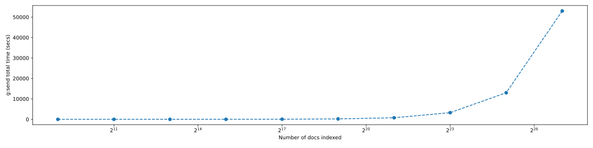

<h3>Results</h3><table border="1" class="dataframe">
  <thead>
    <tr style="text-align: right;">
      <th></th>
      <th>g:send</th>
      <th>g-&gt;p0:send</th>
      <th>p0-&gt;p1:send</th>
    </tr>
  </thead>
  <tbody>
    <tr>
      <th>512</th>
      <td>0.01</td>
      <td>0.007</td>
      <td>0.003</td>
    </tr>
  </tbody>
</table><table border="1" class="dataframe">
  <thead>
    <tr style="text-align: right;">
      <th></th>
      <th>g:send</th>
      <th>g-&gt;p0:send</th>
      <th>p0-&gt;p1:send</th>
    </tr>
  </thead>
  <tbody>
    <tr>
      <th>2048</th>
      <td>0.016</td>
      <td>0.013</td>
      <td>0.003</td>
    </tr>
  </tbody>
</table><table border="1" class="dataframe">
  <thead>
    <tr style="text-align: right;">
      <th></th>
      <th>g:send</th>
      <th>g-&gt;p0:send</th>
      <th>p0-&gt;p1:send</th>
    </tr>
  </thead>
  <tbody>
    <tr>
      <th>8192</th>
      <td>0.052</td>
      <td>0.05</td>
      <td>0.002</td>
    </tr>
  </tbody>
</table><table border="1" class="dataframe">
  <thead>
    <tr style="text-align: right;">
      <th></th>
      <th>g:send</th>
      <th>g-&gt;p0:send</th>
      <th>p0-&gt;p1:send</th>
    </tr>
  </thead>
  <tbody>
    <tr>
      <th>32768</th>
      <td>0.065</td>
      <td>0.06</td>
      <td>0.005</td>
    </tr>
  </tbody>
</table><table border="1" class="dataframe">
  <thead>
    <tr style="text-align: right;">
      <th></th>
      <th>g:send</th>
      <th>g-&gt;p0:send</th>
      <th>p0-&gt;p1:send</th>
    </tr>
  </thead>
  <tbody>
    <tr>
      <th>131072</th>
      <td>0.107</td>
      <td>0.101</td>
      <td>0.006</td>
    </tr>
  </tbody>
</table><table border="1" class="dataframe">
  <thead>
    <tr style="text-align: right;">
      <th></th>
      <th>g:send</th>
      <th>g-&gt;p0:send</th>
      <th>p0-&gt;p1:send</th>
    </tr>
  </thead>
  <tbody>
    <tr>
      <th>524288</th>
      <td>0.095</td>
      <td>0.091</td>
      <td>0.004</td>
    </tr>
  </tbody>
</table><table border="1" class="dataframe">
  <thead>
    <tr style="text-align: right;">
      <th></th>
      <th>g:send</th>
      <th>g-&gt;p0:send</th>
      <th>p0-&gt;p1:send</th>
    </tr>
  </thead>
  <tbody>
    <tr>
      <th>2097152</th>
      <td>0.093</td>
      <td>0.089</td>
      <td>0.005</td>
    </tr>
  </tbody>
</table><table border="1" class="dataframe">
  <thead>
    <tr style="text-align: right;">
      <th></th>
      <th>g:send</th>
      <th>g-&gt;p0:send</th>
      <th>p0-&gt;p1:send</th>
    </tr>
  </thead>
  <tbody>
    <tr>
      <th>8388608</th>
      <td>0.099</td>
      <td>0.094</td>
      <td>0.005</td>
    </tr>
  </tbody>
</table><table border="1" class="dataframe">
  <thead>
    <tr style="text-align: right;">
      <th></th>
      <th>g:send</th>
      <th>g-&gt;p0:send</th>
      <th>p0-&gt;p1:send</th>
    </tr>
  </thead>
  <tbody>
    <tr>
      <th>33554432</th>
      <td>0.099</td>
      <td>0.093</td>
      <td>0.006</td>
    </tr>
  </tbody>
</table><table border="1" class="dataframe">
  <thead>
    <tr style="text-align: right;">
      <th></th>
      <th>g:send</th>
      <th>g-&gt;p0:send</th>
      <th>p0-&gt;p1:send</th>
    </tr>
  </thead>
  <tbody>
    <tr>
      <th>134217728</th>
      <td>0.101</td>
      <td>0.096</td>
      <td>0.005</td>
    </tr>
  </tbody>
</table>

<h3>Num docs vs Time<h3>

