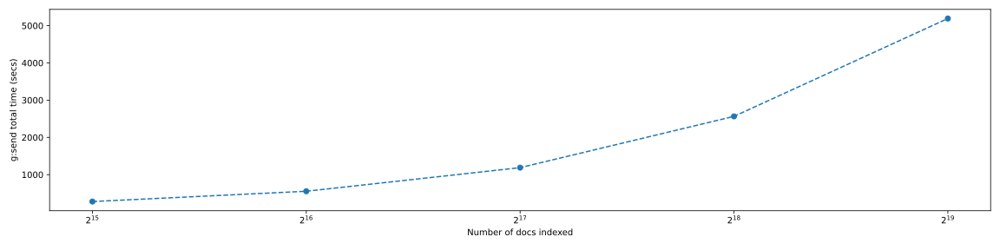

<h1> Benchmark Flows </h1>

Use this to benchmark latencies across different pods.
- Add index yaml in `yamls` folder, pod yamls to the `yamls/pods` folder.
- Takes care of adding `benchmark_driver.yml` pod at the end which determines `start_time` & `end_time` for each pod.
- Supports indexing & querying random `bytes` or `jina_pb2.Document` or `sentences` (to be added). Custom `input_fn` can be added.
- Get benchmarks for different indexing of different #of documents.


<h3> Environment Variables </h3>


```
START_NUM_DOCS - #of documents to start the benchmark with (Default - 2**15)
MULTIPLIER_NUM_DOCS - repetitive multiplcation number from START_NUM_DOCS (Default -2)
COUNT_NUM_DOCS - #of experiments to peform (Default - 5)
e.g.- For START_NUM_DOCS=512, MULTIPLIER_NUM_DOCS=4, COUNT_NUM_DOCS=4, we'll run experiments for [512, 2048, 8192, 32768]

BATCH_SIZE - #of documents per batch (Default - 256)
EMBED_DIM - Dimension for Embedding in jina_pb2.Document (Default - 16)
FILE_DIR - Directory where parquet file & plots will be stored (Default - .data)
```
<h3> Usage </h3>

```
Usage: app.py [OPTIONS]

Options:
  --index-type [bytes|jina_pb2.Document|sentences]
                                  Type of input to be indexed & queried
                                  (Default - bytes)

  --index-yaml TEXT               index yaml file to be loaded in the yamls
                                  directory (Default - index.yml)

  --query-yaml TEXT               query yaml file to be loaded in the yamls
                                  directory (Default - query.yml)

  --num-bytes-per-doc INTEGER     Default - 10
  --num-chunks-per-doc INTEGER    Default - 5
  --num-sentences-per-doc INTEGER
                                  Default - 10
  --help                          Show this message and exit.
```

<h3>Results</h3>


<table border="1" class="dataframe">
  <thead>
    <tr style="text-align: right;">
      <th></th>
      <th>gateway-&gt;pod_0:send</th>
      <th>pod_0-&gt;pod_1:send</th>
      <th>g:send</th>
      <th>pod_1-&gt;benchmark_pod:send</th>
      <th>g:recv</th>
    </tr>
  </thead>
  <tbody>
    <tr>
      <th>32768</th>
      <td>2.0</td>
      <td>0.115</td>
      <td>2.184</td>
      <td>0.069</td>
      <td>0.183</td>
    </tr>
  </tbody>
</table><table border="1" class="dataframe">
  <thead>
    <tr style="text-align: right;">
      <th></th>
      <th>gateway-&gt;pod_0:send</th>
      <th>pod_0-&gt;pod_1:send</th>
      <th>g:send</th>
      <th>pod_1-&gt;benchmark_pod:send</th>
      <th>g:recv</th>
    </tr>
  </thead>
  <tbody>
    <tr>
      <th>65536</th>
      <td>2.004</td>
      <td>0.101</td>
      <td>2.173</td>
      <td>0.067</td>
      <td>0.168</td>
    </tr>
  </tbody>
</table><table border="1" class="dataframe">
  <thead>
    <tr style="text-align: right;">
      <th></th>
      <th>gateway-&gt;pod_0:send</th>
      <th>pod_0-&gt;pod_1:send</th>
      <th>g:send</th>
      <th>pod_1-&gt;benchmark_pod:send</th>
      <th>g:recv</th>
    </tr>
  </thead>
  <tbody>
    <tr>
      <th>131072</th>
      <td>2.131</td>
      <td>0.116</td>
      <td>2.324</td>
      <td>0.077</td>
      <td>0.192</td>
    </tr>
  </tbody>
</table><table border="1" class="dataframe">
  <thead>
    <tr style="text-align: right;">
      <th></th>
      <th>gateway-&gt;pod_0:send</th>
      <th>pod_0-&gt;pod_1:send</th>
      <th>g:send</th>
      <th>pod_1-&gt;benchmark_pod:send</th>
      <th>g:recv</th>
    </tr>
  </thead>
  <tbody>
    <tr>
      <th>262144</th>
      <td>2.288</td>
      <td>0.134</td>
      <td>2.507</td>
      <td>0.085</td>
      <td>0.218</td>
    </tr>
  </tbody>
</table><table border="1" class="dataframe">
  <thead>
    <tr style="text-align: right;">
      <th></th>
      <th>gateway-&gt;pod_0:send</th>
      <th>pod_0-&gt;pod_1:send</th>
      <th>g:send</th>
      <th>pod_1-&gt;benchmark_pod:send</th>
      <th>g:recv</th>
    </tr>
  </thead>
  <tbody>
    <tr>
      <th>524288</th>
      <td>2.336</td>
      <td>0.121</td>
      <td>2.536</td>
      <td>0.08</td>
      <td>0.2</td>
    </tr>
  </tbody>
</table>


<h3>Num docs vs Time<h3>

