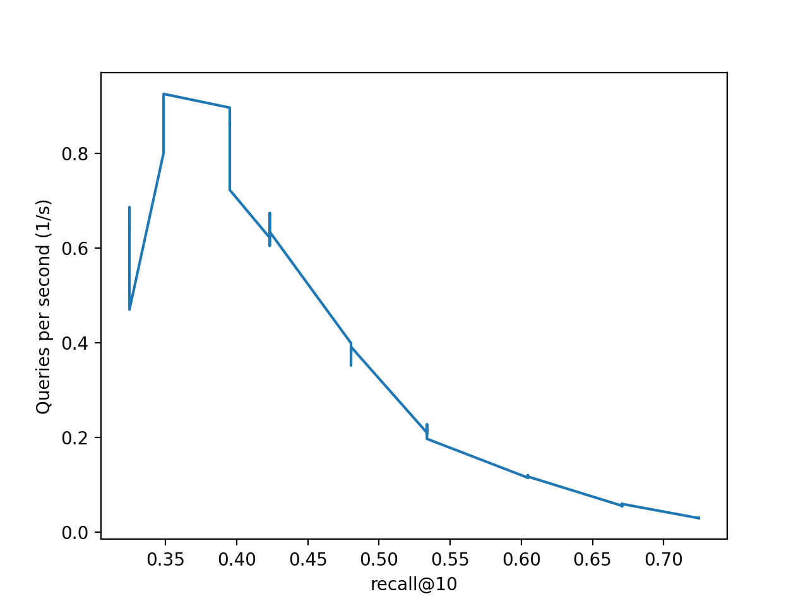

# Vector indexer Stress-Test

These tests are thought to benchmark and assess the performance in quality and speed of different VectorIndexers
integrated by Jina.

The dataset used in the experiments is the SIFT1M, widely used in ANN benchmarking. It can be obtained in http://corpus-texmex.irisa.fr/
The design of this stress test is inspired by https://github.com/erikbern/ann-benchmarks 

In order to prepare the data to execute the experiments just run the command:

```shell script
./get_sift.sh
```

The experiment set is passed to the application through a yaml file that describes the experiments as a set of
indexes types combines with a set of parameter value ranges. All the combinations of parameters described in the yaml file
will be used. 

!WARNING: Every experiment creates its own index file, so the disk consumption can be really large.

An example of experiment yaml file:

```yaml
experiments:
  faiss:
    n_list: [32,64,128,256,512,1024,2048,4096,8192]
    n_probes: [1, 5, 10, 50, 100, 200]
  annoy:
    n_trees: [100, 200, 400]
    search_k: [100, 200, 400, 1000, 2000, 4000, 10000, 20000, 40000,100000, 200000, 400000]
```

The command to launch the experiments is:

Note that the results will be appended to `results.json`

```
python app.py -n 1000 -i -w -q -e -f experiments.yaml
```

The arguments it accepts are:

- batch_size (-n): The batch size that will be passed to the indexer
- top_k (-k): The number of similar vectors it will ask the indexer for
- file_path (-f): Yaml file describing the experiment or set of experiments to run
- index command (-i): Force the experiment to run the indexing part of experiment
- warmup command (-w): Force the experiment to run the build and warmup command appart from query. Useful to measure querying type independently.
- query command (-q): Force to run the queries
- evaluate command(-e): Force the evaluation.

Important to notice that for -w , -q, and -e to work, an index command must have been done, and the indexer binaries and vector files must still be in the `workspace` folder

### Visualization

To see the visualization run 
```
python plot.py
```

This will use the `results.json` and plot a graph

#### Example

This is how the data for Faiss looks like


